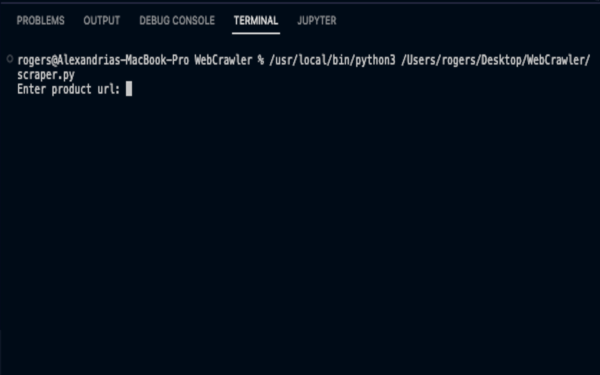

# Amazon Web Scraper

## Description

This project is a Python program that "web scrapes" Amazon product information using the library Beautiful Soup. 🍜 Here is the Final result:

## SetUp

requests: Sends HTTP requests.  
beautifulsoup4: Pulls data out of HTML and XML files. 
lxml: Provides powerful API for parsing HTML and XML.

## Install

To install the three libraries above, run the following in your VS Code terminal:

pip install requests beautifulsoup4 lxml
